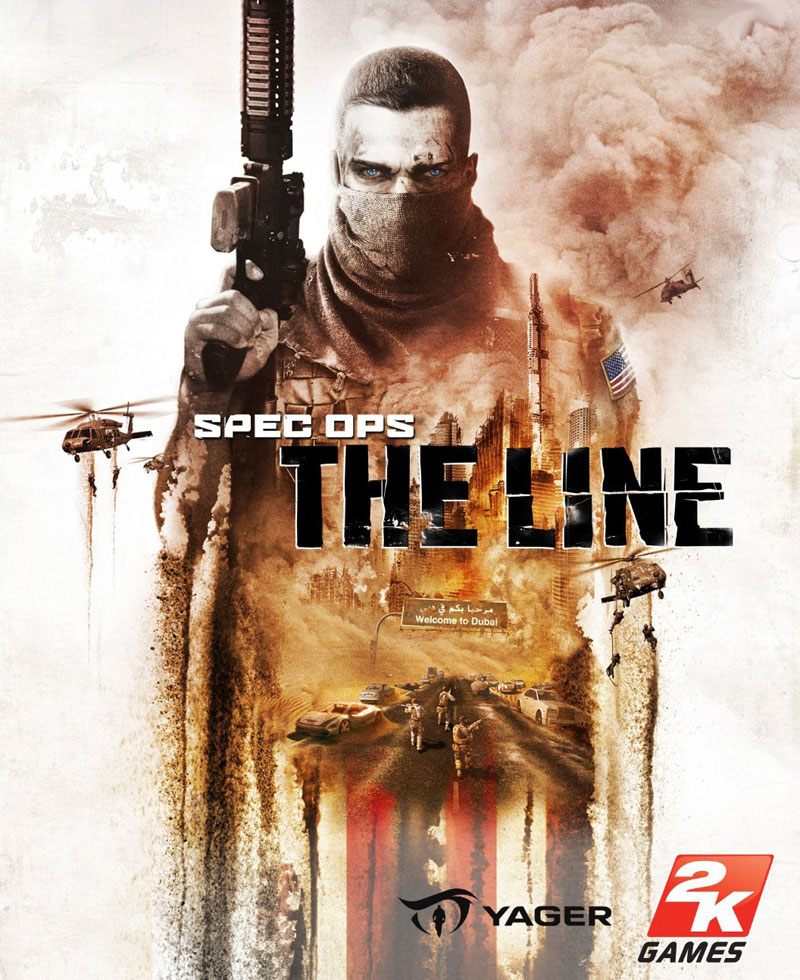
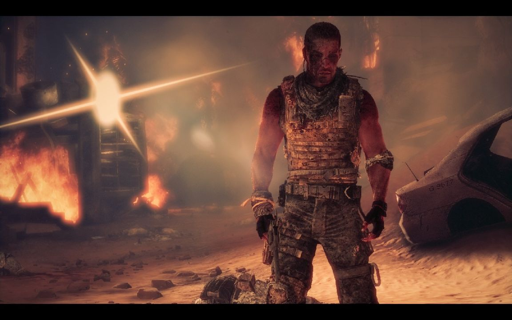
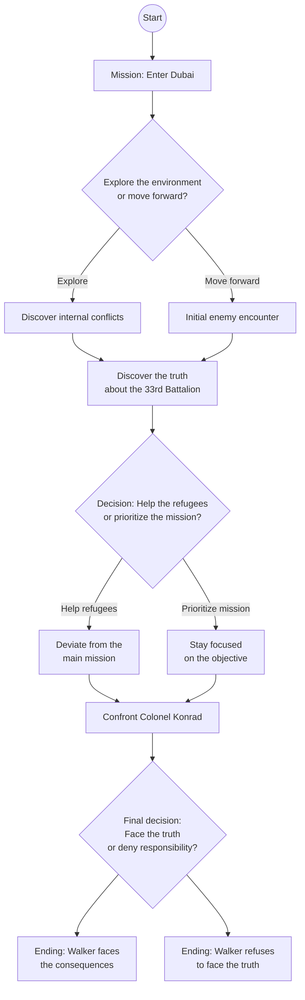
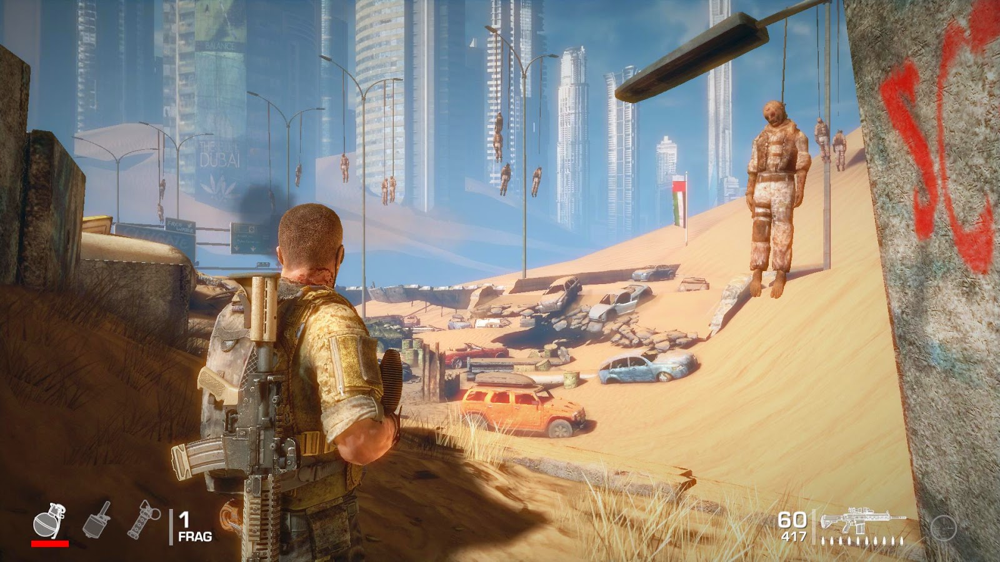
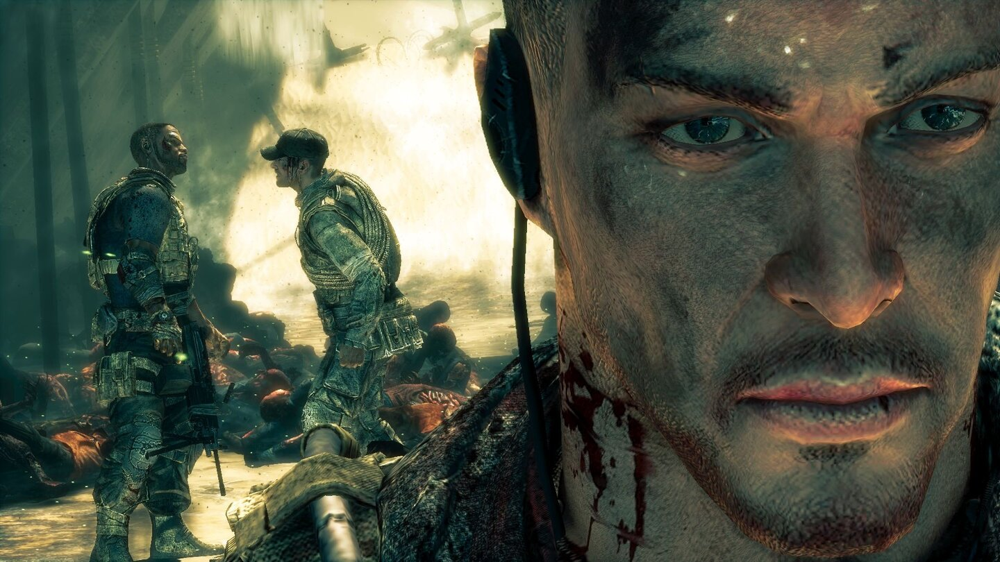

# Spec Ops: The Line

**Developer**: Yager Development  
**Publisher**: 2K Games  
**Release Year**: 2012

> *“A line, like the one we crossed today, is something you have to be born to.”*  
> – *Martin Walker*

---

## Introduction

**Spec Ops: The Line** is a tactical action game that challenges players to question their moral decisions while exploring the devastating effects of war. This document recreates a summary of the game's plot and uses diagrams to represent key narrative branches and critical choices faced by the protagonist, Captain Martin Walker.

## Main Character

### *Captain Martin Walker*

## Narrative Flowchart - Critical Choices

### Explanation:
In this diagram, we represent the major choices that affect the narrative of Spec Ops: The Line. Depending on the player's decisions, the protagonist may discover the truth about the conflict and its emotional toll, or continue to deny responsibility.

---

## Key Moments Analysis

### Initial Mission:
Captain Walker leads the Delta Force team into Dubai, a city devastated by a massive sandstorm, for a reconnaissance mission. Associated image:

---

### Discovery of the 33rd Battalion:
While exploring the city, Walker learns that the 33rd Battalion, originally sent to rescue civilians, is now considered an enemy. Associated image:

---

### Moral Choice: The Refugees or the Mission:
A critical moment where Walker must decide whether to assist the refugees, diverting from the original mission, or continue focusing on the primary objective. Associated image:

---

## Conclusion
The narrative of *Spec Ops: The Line* is a dark journey through complex moral decisions and the psychology of war. The player is forced to confront the consequences of their actions and question the boundaries between hero and villain.

---

## Alternate Endings
Depending on the player's choices throughout the narrative, the game can end in various ways, each reflecting the consequences of the decisions made.
